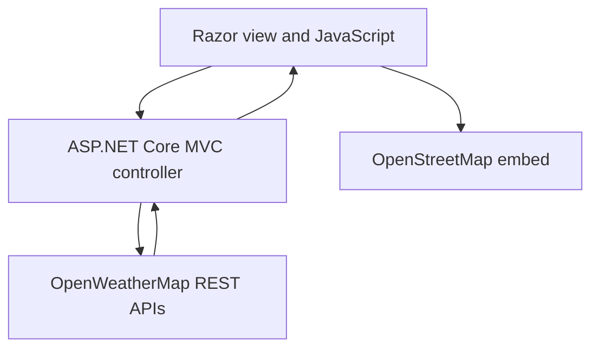

# Live Weather & Map

[](https://dotnet.microsoft.com/en-us/download/dotnet/6.0)
[](https://nunit.org/)
[](https://weatherapp-deanholland.azurewebsites.net/)

**Live Weather & Map** is an ASP.NET Core MVC weather dashboard that combines current conditions, multi-day forecast analysis, and interactive mapping in one responsive interface.

Users can search for a place manually or allow browser location access. The application retrieves live data from OpenWeatherMap through server-side controller actions, groups three-hour forecast readings into daily summaries, and centres an OpenStreetMap view on the selected coordinates.

## Live Demo

**[Open Live Weather & Map](https://weatherapp-deanholland.azurewebsites.net/)**

The Azure App Service may take up to a minute to wake after a period of inactivity. Browser location permission is optional; enter a town or city to search manually instead.

## Overview

The project demonstrates a complete external-API workflow across an ASP.NET Core MVC back end and a JavaScript front end. The browser requests weather data from the application's controller endpoints, the controller calls OpenWeatherMap asynchronously, and the returned coordinates are used to refresh an embedded OpenStreetMap.

Forecast processing happens in the browser. Three-hour readings are grouped by date and converted into concise daily average, highest, and lowest temperature summaries.

## Features

### Location lookup

- Search for weather by town, city, or another OpenWeatherMap-supported location
- Use browser geolocation to load weather for the user's current coordinates
- Fall back to manual search when location permission is unavailable or declined
- Display clear feedback for empty or invalid searches

### Current conditions

- Current temperature in degrees Celsius
- Humidity percentage
- Human-readable weather description
- Browser-formatted sunrise and sunset times

### Forecast analysis

- Retrieve OpenWeatherMap's five-day, three-hour forecast data
- Group individual forecast readings into daily summaries
- Calculate the average, highest, and lowest temperature for each displayed day
- Replace previous results when the user searches for another location

### Interactive map

- Centre an OpenStreetMap embed on the coordinates returned with the weather data
- Refresh the surrounding map whenever the selected location changes
- Keep weather information and geographical context together on one page

### Responsive interface

- Responsive search controls for desktop and mobile widths
- Flexible forecast cards that wrap as the available space changes
- Bootstrap layout components with focused custom CSS and JavaScript

## Core Workflows

### 1. Search by location

The user enters a location. JavaScript URL-encodes the value and requests current weather and forecast data from the MVC controller. The controller queries OpenWeatherMap, deserialises the JSON response, and returns the relevant data to the browser for rendering.

### 2. Use the current position

If the user grants browser location permission, the application sends the supplied latitude and longitude to dedicated controller actions. The same coordinates determine the centre of the OpenStreetMap view.

### 3. Summarise the forecast

The browser groups the returned three-hour forecast entries by date, calculates daily average, high, and low temperatures, and renders the upcoming days as responsive forecast cards.

## System Architecture



The application separates responsibilities across three main areas:

1. **Presentation layer**
   - Razor views, Bootstrap, and responsive CSS
   - Browser geolocation, API requests, forecast aggregation, and DOM updates in JavaScript

2. **Application layer**
   - MVC routes for location-based and coordinate-based requests
   - Asynchronous HTTP orchestration and external-response handling

3. **External-service integration**
   - OpenWeatherMap current-weather and five-day forecast endpoints
   - OpenStreetMap's embeddable map view

## External Services

| Service | Responsibility |
| --- | --- |
| OpenWeatherMap Current Weather API | Returns live conditions and coordinates for a location |
| OpenWeatherMap 5 Day / 3 Hour Forecast API | Supplies forecast readings used to calculate daily summaries |
| OpenStreetMap | Displays an interactive map centred on the resolved coordinates |
| Browser Geolocation API | Optionally supplies the user's latitude and longitude |

## Technology Stack

| Area | Technology |
| --- | --- |
| Web application | .NET 6, ASP.NET Core MVC, Razor Views |
| External data | OpenWeatherMap REST APIs |
| Mapping | OpenStreetMap embedded map |
| HTTP and JSON | `IHttpClientFactory`, `HttpClient`, Newtonsoft.Json |
| Front end | HTML, CSS, JavaScript, Bootstrap |
| Testing | NUnit, Moq, mocked `HttpMessageHandler`, Coverlet |
| Delivery | GitHub Actions build/test/publish workflow and Azure App Service |

## Automated Tests

The solution contains **10 NUnit test methods** covering the server-side weather integration without making live external API calls. Moq supplies a controlled `HttpMessageHandler`, allowing success and failure paths to be tested deterministically.

Coverage includes:

- current-weather lookup by location
- current-weather lookup by latitude and longitude
- five-day forecast lookup by location
- five-day forecast lookup by latitude and longitude
- unsuccessful upstream API responses
- empty and invalid location input

Run the complete suite with:

```bash
dotnet test --configuration Release
```

The repository also contains a GitHub Actions workflow that restores, builds, tests, publishes the web project, and uploads the published output as an artifact for pushes and pull requests targeting `main`.

## Running the Project Locally

### Prerequisites

- [.NET 6 SDK](https://dotnet.microsoft.com/en-us/download/dotnet/6.0)
- A free [OpenWeatherMap API key](https://openweathermap.org/api)

### 1. Clone and restore

```bash
git clone https://github.com/DeanProgramming/WeatherApp.git
cd WeatherApp
dotnet restore
```

### 2. Configure the API key

The current implementation reads the key from the `apiKey` field in `DeanH-WeatherApp/Controllers/HomeController.cs`. Replace the checked-in placeholder in your local working copy:

```csharp
public string apiKey = "YOUR_OPENWEATHERMAP_API_KEY";
```

Do not commit a real API key. Moving this setting to user secrets or environment-backed configuration is listed as a next step below.

### 3. Run the application

```bash
dotnet run --project DeanH-WeatherApp/DeanH-WeatherApp.csproj
```

Open the HTTPS address printed by ASP.NET Core in the terminal.

## Configuration

| Setting | Purpose | Required |
| --- | --- | --- |
| `HomeController.apiKey` | Authenticates requests to OpenWeatherMap | Yes |
| Browser location permission | Enables automatic coordinate-based lookup | No |

Weather requests use metric units, so temperatures are returned and displayed in degrees Celsius.

## Project Structure

| Path | Contents |
| --- | --- |
| `DeanH-WeatherApp/Controllers` | MVC actions and OpenWeatherMap request orchestration |
| `DeanH-WeatherApp/Models` | Current-weather and forecast response models |
| `DeanH-WeatherApp/Views` | Razor pages and shared layout |
| `DeanH-WeatherApp/wwwroot/js` | Geolocation, fetching, forecast analysis, and UI rendering |
| `DeanH-WeatherApp/wwwroot/css` | Responsive application styling |
| `WeatherAppTestProject` | NUnit and Moq test suite |
| `.github/workflows` | Automated restore, build, test, publish, and artifact workflow |

## Design Documentation

The original project design, component breakdown, and architectural decisions are documented in the **[Live Weather and Map Application Design Document](https://deanprogramming.github.io/CV/Live%20Weather%20and%20Map%20Application%20Design%20Doc.pdf)**.

## API and Data Notes

- Weather and forecast values depend on OpenWeatherMap availability, coverage, and API limits.
- OpenStreetMap is loaded as an external embedded map after a location is resolved.
- Location permission is handled by the browser and is not required for manual searches.
- The application does not create user accounts or persist searched locations.
- Sunrise and sunset timestamps are formatted using the browser's locale and time zone.

## Current Limitations and Next Steps

This repository is a focused portfolio project rather than a production weather platform. The main next steps are:

- add explicit HTTP timeouts, cancellation support, and a typed weather client
- expand integration and browser-side tests around forecast aggregation and rendering

## Author

Built by **Dean Holland** as a personal software-development portfolio project.

GitHub: [DeanProgramming](https://github.com/DeanProgramming)
